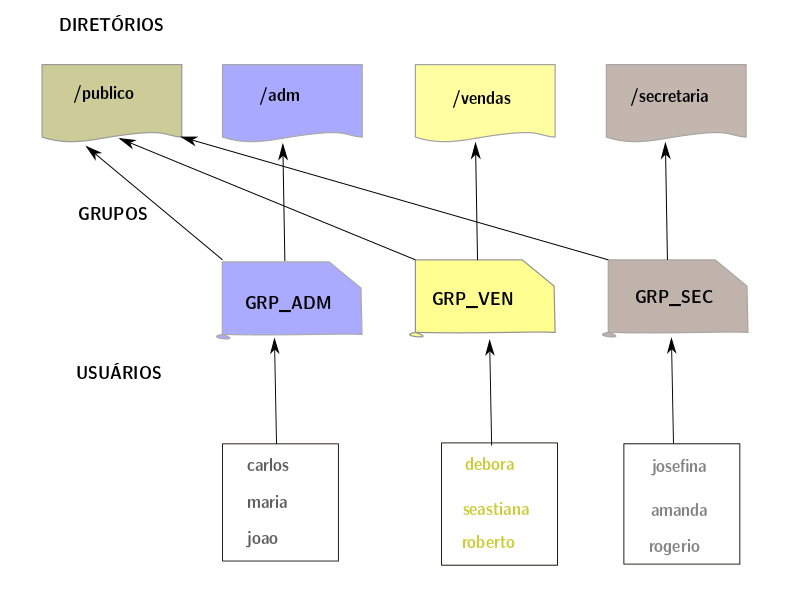

#                    Gerenciamento e provisionamento da infraestrutura por meio de código. 

### As definições da estrutura de usúarios tem como base a figura abaixo e seguem as seguintes premissas: 

>- Todos os usuários terão permissão total dentro do diretório **publico**;
>- Os usuários pertencentes a cada grupo terão permissão total dentro de seus respectivos diretórios;
>- Os usuários não terão permissão de leitura, escrita e execução em diretórios de departamentos que eles pertencem;

